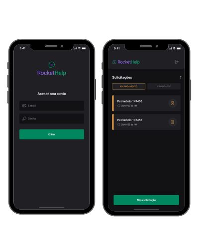

# Projeto :rocket:

- Aplicativo desenvolvido durante a semana ignite lab da Rocketseat

## Tecnologias e Ferramentas utilizadas :robot:

- [VsCode](https://code.visualstudio.com/)
- [ReactNative](https://reactnative.dev/docs/environment-setup)
- [React Navigation](https://reactnavigation.org/)
- [Expo](https://expo.dev/)
- [Expo Fonts](https://docs.expo.dev/guides/using-custom-fonts/)
- [NativeBase](https://nativebase.io/)
- [SVG Transform](https://github.com/kristerkari/react-native-svg-transformer)
- [PhosphorIcons](https://github.com/duongdev/phosphor-react-native)
- [RNFirebase](https://rnfirebase.io/)
- [Cloud Firestore](https://rnfirebase.io/firestore/usage)
- [Authentication Firebase](https://rnfirebase.io/auth/usage)

## Como utilizar :runner:

- Clonar o repositório
- Na pasta do projeto instalar as dependências com o comando npm install
- Colocar o cabo usb do seu celular conectado ao computador com a opção desenvolvedor ativada
- Depois rodar a aplicação com o comando expo run:android

## Aplicativo :phone:

